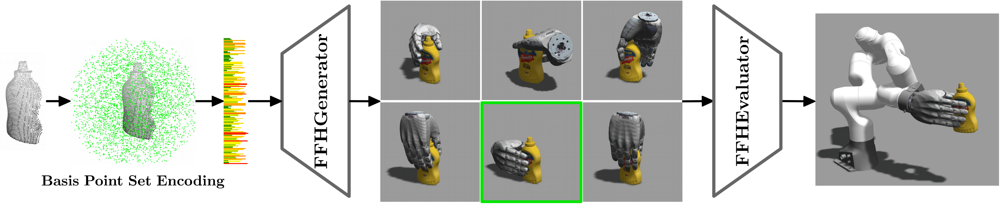
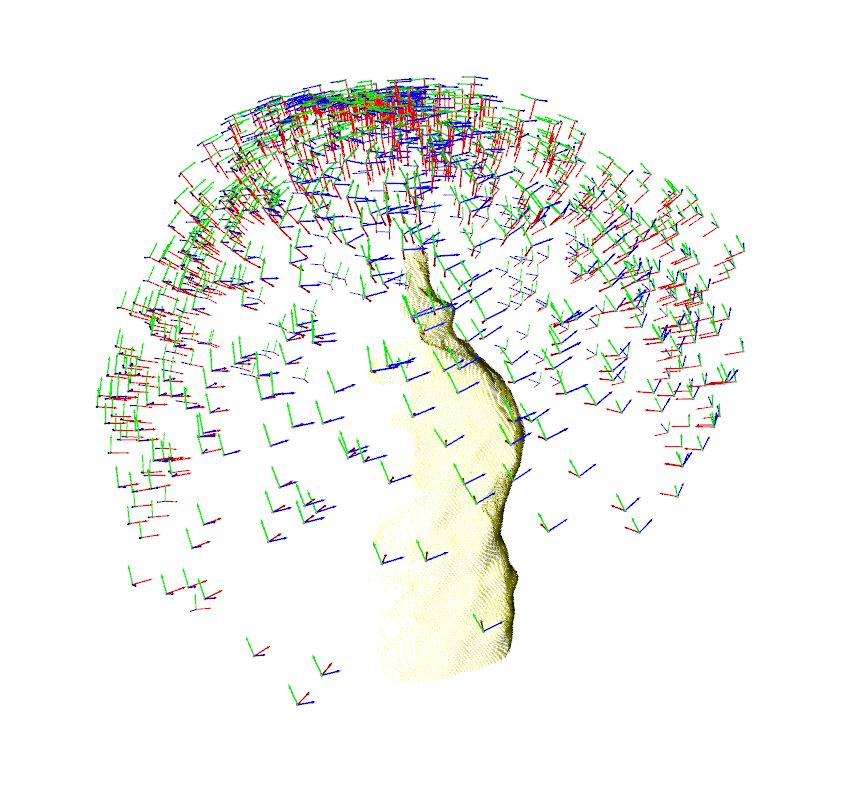
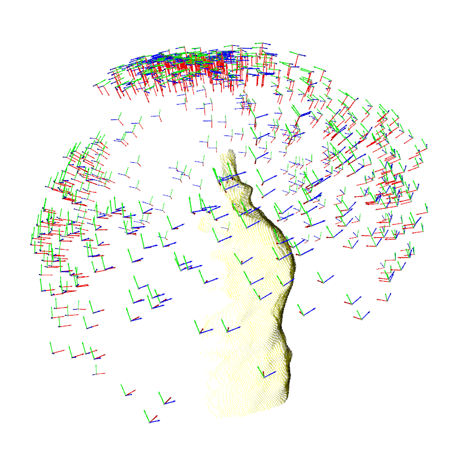
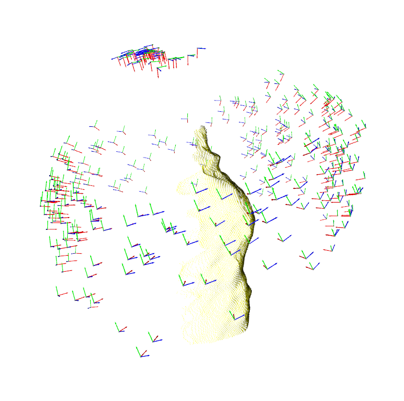
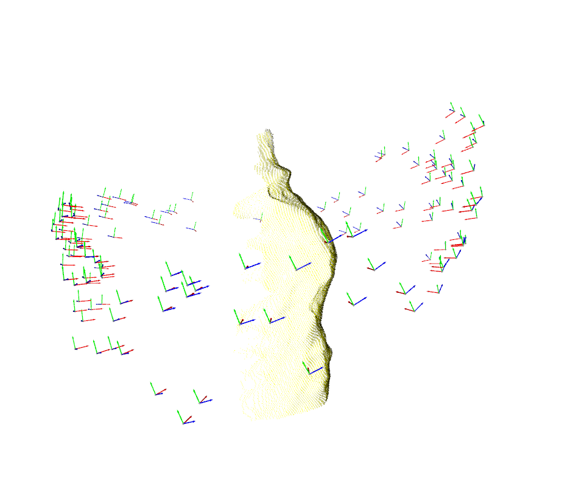
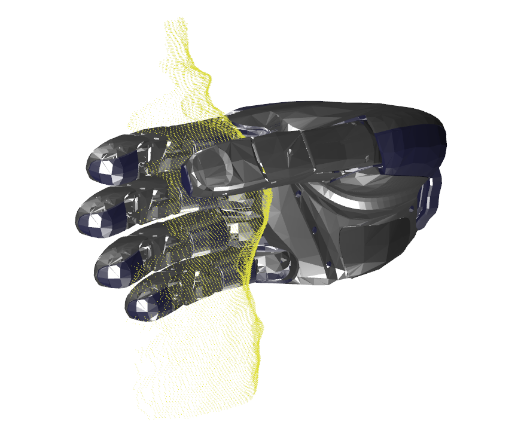

# Multi-Fingered Net
Mirrored from https://github.com/qianbot/FFHNet-dev \
Based on: FFHNet (ICRA 2022 [Paper](https://ieeexplore.ieee.org/document/9811666)) is an ML model which can generate a wide variety of high-quality multi-fingered grasps for unseen objects from a single view.

Generating and evaluating grasps with FFHNet takes only 30ms on a commodity GPU. To the best of our knowledge, FFHNet is the first ML-based real-time system for multi-fingered grasping with the ability to perform grasp inference at 30 frames per second (FPS).

For training, we synthetically generate 180k grasp samples for 129 objects. We are able to achieve 91% grasping success for unknown objects in simulation and we demonstrate the model's capabilities of synthesizing high-quality grasps also for real unseen objects.



## Installation

After you clone the repo. Use git lfs to download the model.

```
git lfs pull
```

Create a new conda environment with cudatoolkit 10.1

```
conda create -n myenv python==3.8
conda install -c anaconda cudatoolkit=10.1
```

Install all dependencies.

```
pip install -r requirements.txt
pip install git+https://github.com/otaheri/chamfer_distance
pip install git+https://github.com/otaheri/bps_torch
```

## Grasp Data Preparation

This section details the step to bring the grasping data into the right format.

1. Collect all ground truth data into one directory with folders for each recording.

```bash
    Data
      ├── 2021-03-02
      |         ├── grasp_data (folder with images of grasp)
      |         ├── grasp_data.h5 (file with all the poses)
      ...
      ├── 2021-03-10
```

2. Execute the script `grasp_pipeline/src/grasp_pipeline/grasp_data_processing/merge_raw_grasp_data.py` \
This will go through all the folders under dataset folder and combine all `grasp_data.h5` files into one combined h5 file called `grasp_data_all.h5` (old name is `ffhnet-grasp.h5`).

3. Execute the script `grasp_pipeline/src/grasp_pipeline/grasp_data_processing/data_augmentation.py` (`data_augmentation_multi_obj.py` for multiple objects scenes)
This will go through all the objects in `grasp_data_all.h5` and spawn each object in `n_pcds_per_object` random positions and orientations, record a segmented point cloud observation as well as the transformation between the mesh frame of the object and the object centroid frame. All transforms get stored in `pcd_transforms.h5`.

3.1 Add train/test/eval split manually.
The script also creates `metadata.csv` which contains the columns \
object_name | collision | negative | positive | train | test | val \
An `X` in train/test/val indicates that this object belongs to the training, test or val set.
A `XXX` indicates that the object should be excluded, because the data acquisition was invalid.

4. Execute the script `FFHNet-dev/scripts/train_test_val_split.py` which given the `metadata.csv` file splits the data in the three folders `train`, `test`, `val`. Under each of the three folders lies a folder `point_clouds` with N `.pcd` files of objects from different angles.
The split rules follow the
5. Execute the script `bps_torch/convert_pcds_to_bps.py` in repo `https://github.com/qianbot/bps-torch.git` which will first compute a BPS (basis point set) and then computes the bps representation for each object storing them in a folder `bps` under the respective object name.

6. rename `point_cloud` to `pcd` besides `bps` folder for dataloader visualization.

If you train a model with direct point cloud:
- run `scripts/save_pcd_center.py` to generate object center

- If obstacle pcd/bps is needed, run script `/scripts/get_obstacle_pcd.py`

- if need to down sample the point cloud, run script `/script/downsample_dataset.py`

## To run the train script

### Train FFHEvaluator


Modify the `config.yaml` with correct path.
```
python train.py --config models/ffhgenerator/config.yaml
```

### Train FFHGenerator

Modify the `config.yaml` with correct path.
```
python train.py --config models/ffhgenerator/config.yaml
```

## To run the evaluation script

### Evaluate the FFHEvaluator
```
python eval.py
```

| Data distribution from FFHGenerator  | Filter grasps with 0.5 thresh | Filter grasps with 0.75 thresh
| --------------------------------------- | --------------------------------------- |--------------------------------------- |
|        |  |  |

| Filter grasps with 0.9 thresh  | Best grasp |
| --------------------------------------- | --------------------------------------- |
|        |  |  |

## Citation

```plain
@INPROCEEDINGS{2022ffhnet,
  author={Mayer, Vincent and Feng, Qian and Deng, Jun and Shi, Yunlei and Chen, Zhaopeng and Knoll, Alois},
  booktitle={2022 International Conference on Robotics and Automation (ICRA)},
  title={FFHNet: Generating Multi-Fingered Robotic Grasps for Unknown Objects in Real-time},
  year={2022},
  volume={},
  number={},
  pages={762-769},
  doi={10.1109/ICRA46639.2022.9811666}}
```

## Acknowledgement

[bps_torch](https://github.com/otaheri/bps_torch)
