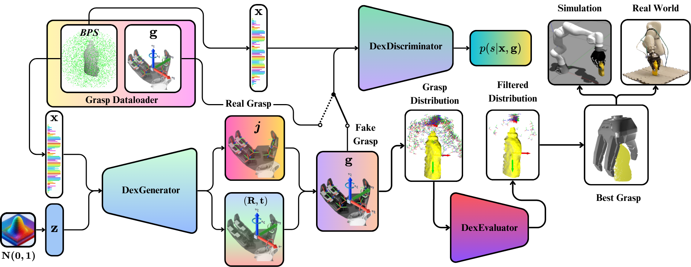
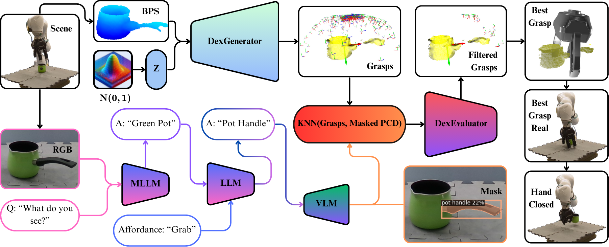

# DexGANGrasp: Dexterous Generative Adversarial Grasping Synthesis for Task-Oriented Manipulation
[[paper](https://arxiv.org/pdf/2407.17348)] [[video](https://youtu.be/egQaemeAy5k)] [[arXiv](https://arxiv.org/abs/2407.17348)] [[project site](https://david-s-martinez.github.io/DexGANGrasp.io/)] [[dataset](https://syncandshare.lrz.de/getlink/fiDFvyFKo4bwn4dXVwAVq5/)]

Qian Feng*, David S. Martinez Lema*, Mohammadhossein Malmir, Hang Li, Jianxiang Feng, Zhaopeng Chen, Alois Knoll

*: Equal Contribution

We introduce DexGANGrasp, a dexterous grasping synthesis method that generates and evaluates grasps with single view in real time. DexGanGrasp comprises a Conditional Generative Adversarial Networks (cGANs)-based DexGenerator to generate dexterous grasps and a discriminator-like DexEvalautor to assess the stability of these grasps. Extensive simulation and real-world expriments showcases the effectiveness of our proposed method, outperforming the baseline FFHNet with an 18.57% higher success rate in real-world evaluation.




We further extend DexGanGrasp to DexAfford-Prompt, an openvocabulary affordance grounding pipeline for dexterous grasping leveraging Multimodal Large Language Models (MLLMs) and Vision Language Models (VLMs), to achieve task-oriented grasping with successful real-world deployments.




## Installation

Clone this repo recursively via:
```
git clone --recursive 
```

Create a new conda environment with cudatoolkit 11.8

```
conda create -n myenv python==3.8
conda install -c anaconda cudatoolkit=11.8
```

Install all the dependencies for DexGanGrasp:

```
pip install torch==2.0.0 torchvision==0.15.1 torchaudio==2.0.1 --index-url https://download.pytorch.org/whl/cu118

export MAX_JOBS=4 && pip install --no-cache-dir "git+https://github.com/facebookresearch/pytorch3d.git@stable" --user

pip install git+https://github.com/otaheri/chamfer_distance

pip install git+https://github.com/otaheri/bps_torch

pip install -r requirements.txt
```
Install all dependencies for VLPart.
```
git clone https://github.com/facebookresearch/detectron2.git
cd detectron2
pip install -e .
cd ..

git clone https://github.com/david-s-martinez/vlpart.git
cd VLPart
pip install -r requirements.txt
```
## To run the train script

### Train DexGenerator

```
python3 train.py
```

## To run the evaluation script

### Evaluate the DexGenerator with Mean Absolute Grasp Deviation (MAGD)
```
python3 eval.py
```
## To run the inference scripts

### Run DexGANGrasp offline on real data (without robot)
```
python3 dexgangrasp_offline.py
```
### Visualize DexAfford Prompt offline (without robot and API key)
```
python3 dexafford_prompt_offline.py
```
## Citation

```plain
@misc{feng2024dexgangraspdexterousgenerativeadversarial,
title={DexGANGrasp: Dexterous Generative Adversarial Grasping Synthesis for Task-Oriented Manipulation}, 
author={Qian Feng and David S. Martinez Lema and Mohammadhossein Malmir and Hang Li and Jianxiang Feng and Zhaopeng Chen and Alois Knoll},
year={2024},
eprint={2407.17348},
archivePrefix={arXiv},
primaryClass={cs.RO},
url={https://arxiv.org/abs/2407.17348}, 
}
```